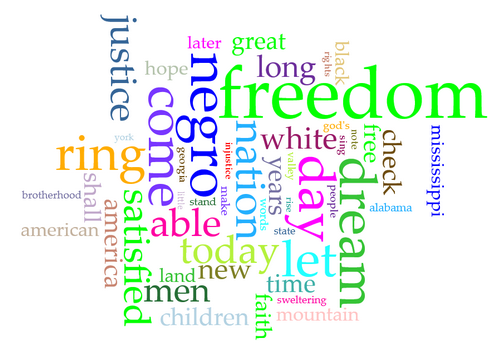
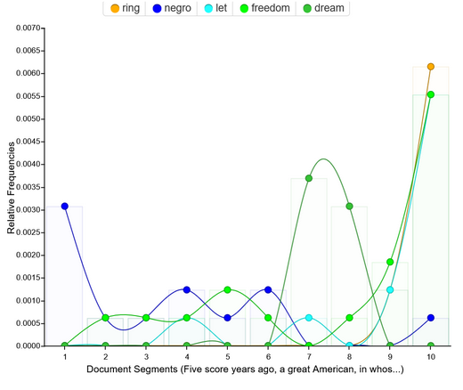
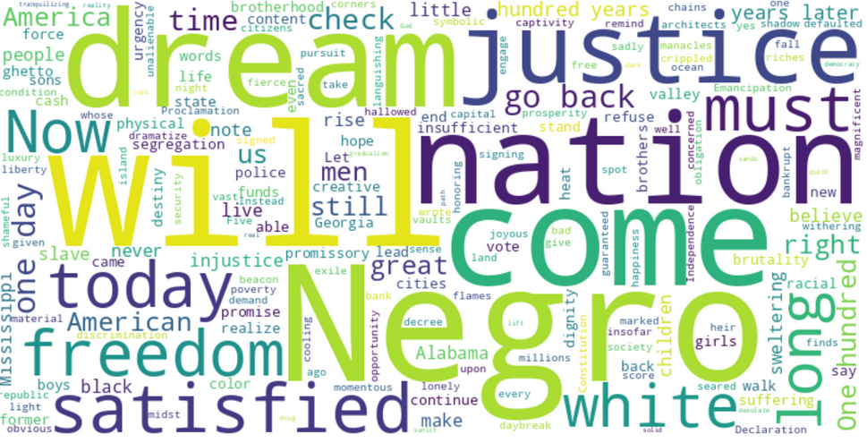
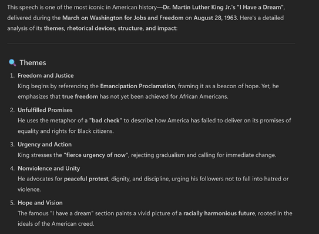



# Distant Reading Assignment 

I decided to have Voyant and Copilot analyze Martin Luther King's I Have a Dream speech. I believe Voyant has a lot more cooler functions that Copilot lacks. 
The presence of words being graphed throughout a piece is actually very helpful in measuring how MLK shifts through specific themes within his speech. 
Seeing freedom and ring at the end shoot up shows the development of black freedoms translates to freedoms for all Americans. Overall, Voyant was successful and accurate. 
However, Copilot's analysis was less than helpful. Most of the "analysis" was rehashing what was said in the speech. While it was not inaccurate, I would have gotten way more 
thorough and depth information from reading the spark notes of the speech. I believe for the energy cost and lack of depth of Copilot leaves much to be desired. I believe that 
both of these tools lack the ability to mesh the historical context with the themes within the text. Because of this limitation, it is always best to read through the texts 
yourself to make the connections to truly understand the meaning behind what you read.  

 # **Voyant**
  

 # **Copilot**
 

